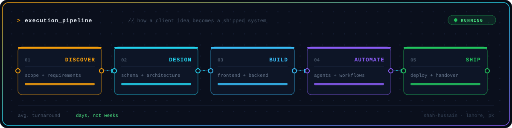
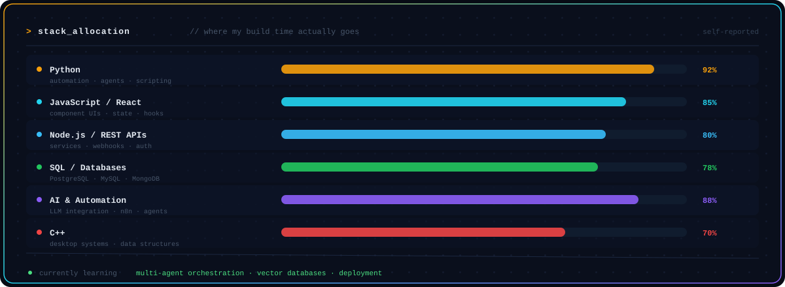

<div align="center">
  
</div>

<div align="center">
  
</div>

<div align="center">
  
  
  
  
</div>

<br />

## `01` — TRIGGER

```yaml
node: about_me
type: manual_trigger
```

I'm a Computer Science student at the **University of Lahore** and a freelance developer.
Most people build the app and stop there. I build the app, then build the system that runs it
without anyone watching — agents that handle multi-step tasks, workflows that fire on webhooks,
pipelines that clean up after themselves.

If a task is repeatable, I think it should be automated. That belief is basically my whole stack.

<br />

## `02` — PROCESS

<div align="center">
  
</div>

<br />

## `03` — RESOURCES

<div align="center">
  
</div>

<details>
<summary><b>&nbsp;▸ &nbsp;Expand full toolchain</b></summary>
<br />

| Layer | Tools |
|---|---|
| **Languages** | Python · C++ · JavaScript · SQL |
| **Frontend** | React.js · HTML5 · CSS3 |
| **Backend** | Node.js · REST APIs · Webhooks |
| **AI / Automation** | Agentic AI systems · LLM integration · n8n workflows |
| **Databases** | PostgreSQL · MySQL · MongoDB · schema design |
| **Platforms** | Git & GitHub · VS Code · Shopify |

</details>

<br />

## `04` — OUTPUT

<table>
<tr>
<td width="50%" valign="top">

### AI Workflow Automation System
An agentic system in Python that takes a business task, breaks it into steps, and executes them
on its own. LLM APIs handle the natural-language parts; the orchestration layer handles the rest.

`Python` `LLM APIs` `Agentic AI`

</td>
<td width="50%" valign="top">

### Full-Stack Web Application
A complete product build — React frontend, Node backend, PostgreSQL underneath, tied together
with a clean REST API architecture.

`React.js` `Node.js` `PostgreSQL`

</td>
</tr>
<tr>
<td width="50%" valign="top">

### HR & Payroll Management System
A desktop system in C++ covering employee records, payroll calculation, and reporting —
built close to the metal, no framework holding my hand.

`C++` `File I/O`

</td>
<td width="50%" valign="top">

### Restaurant Chatbot (n8n)
A chatbot wired into a live restaurant website through webhooks, running on an n8n workflow
that handles orders and queries without a human in the loop.

`n8n` `Webhooks` `Automation`

</td>
</tr>
</table>

<details>
<summary><b>&nbsp;▸ &nbsp;Other things I've shipped</b></summary>
<br />

- **Library Books Management System** — database-driven, full CRUD, SQL queries, clean interface
- **E-Commerce Support Agent** — automated customer query handling
- **Social Media Suggestion Manager** — content ideas generated on a schedule
- **Daily News Digest Agent** — scrapes, summarises, and delivers, unattended
- **Shopify Store Setup** — product listings, payment integration, theme customisation

</details>

<br />

## `05` — LOGS

<div align="center">


</div>

<br />

## `06` — WEBHOOK

<div align="center">

Got a workflow that eats your day? Send it my way.

<a href="https://linkedin.com/in/shah-hussain">
  
</a>
<a href="mailto:bosss0007860@gmail.com">
  
</a>

</div>

<br />

<div align="center">
  <sub><code>workflow finished · 0 errors · always shipping</code></sub>
</div>
